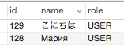

# Hotel Booking Service (Servlet)

 Система Заказ гостиницы. Клиент заполняет Заявку, указывая количество мест в номере, класс апартаментов и время пребывания. Администратор просматривает поступившую Заявку, выделяет наиболее подходящий из доступных Номеров, после чего система выставляет Счет Клиенту. 
 
 ## Установка

Шаг 1. Скачайте репозиторий
Шаг 2. База данных.
Устанвите базу данных с помощью следующей консольной команды:
```
mysql -u root -p < src/main/resources/sql/hotel.sql
```
Создается новый пользователь и база данных. 
Также в базе данных будут созданы два пользователями приложения - admin(пароль - 123) и user(пароль - 123).

## Запуск

Откройте Intellij IDEA.
Импортируйте загруженный проект.

В случае успешного запуска, сайт будет отображаться на порту 8080:

http://localhost:8080/

## Features

Использовано:
 - Java 8;
 - Servlets;
 - View: JSP + JSTL
 
 - streams
 - optionals
 - Шаблоны:
        - Шаблонный метод
        - Делегат
        
 - Двуязычный сайт (поддерживает укр и англ; язык по умолчанию - укр)
 - Сохраняет язык, выбранный пользователем (активный язык при регистрации); 
 - Поддерживает интернациональные имена пользователей：
    - Хранение в базе данных:
    
        
    - Авторизация на сайте: 
    
        
        
        
 - Password encrypted (SHA250)
